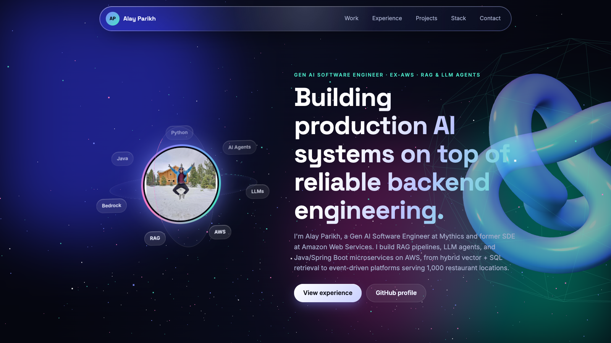

  <a href="https://alayparikh.github.io"><b>🌐 Open my interactive portfolio →</b></a>

# Hi, I'm Alay Parikh

**Gen AI Software Engineer @ Mythics · ex-SDE @ Amazon Web Services**

I build production AI systems on top of reliable backend engineering: RAG pipelines, LLM agents, and Java/Spring Boot microservices on AWS.

- Hybrid retrieval (vector embeddings + SQL joins) on **AWS Bedrock** for transactional and financial queries
- **LLM agents** that automate operational investigations across logs, telemetry, and relational data
- Event-driven **Order-to-Cash** platform serving 1,000 restaurant locations (SNS, Lambda, RDS, Terraform CI/CD)
- At AWS: build-time config-gap detection across isolated regions, REST APIs, SNS/SQS pipelines, on-call ownership

## Featured projects

| Project | What it is | Links |
|---|---|---|
| **personalRagAssistant** | Personal knowledge retrieval and document-grounded assistant | [Code](https://github.com/alayparikh/personalRagAssistant) |
| **ai-job-search** | Local AI-agent framework for evaluating roles and preparing applications | [Code](https://github.com/alayparikh/ai-job-search) |
| **reviewpilotCTO** | AI review-focused product prototype | [Live](https://reviewpilot-hazel.vercel.app/) · [Code](https://github.com/alayparikh/reviewpilotCTO) |

More: [reviewIQ](https://review-iq-freeplan.vercel.app/) · [websiteBuilder](https://buildwisewebs.vercel.app/) · [Haritech](https://www.haritechautomations.com/) · [Radiant Control Systems](https://radiantcontrolsystems.com/)

## Stack

`Java` `Python` `Spring Boot` `RAG` `LLM Agents` `MCP` `LangChain` `LangGraph` `AWS Bedrock` `Lambda` `SNS/SQS` `EKS` `Docker` `Kubernetes` `Terraform` `GitHub Actions` `Amazon RDS` `Kafka` `Vector DBs` `React`

## Contact

[LinkedIn](https://www.linkedin.com/in/alay-parikh/) · [Email](mailto:alayparikh98@gmail.com) · [Portfolio](https://alayparikh.github.io)
